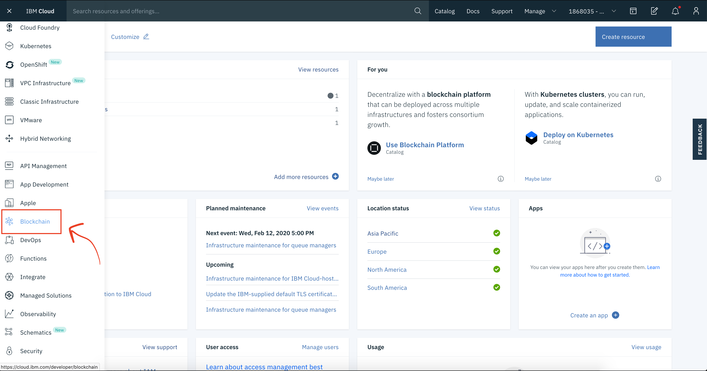
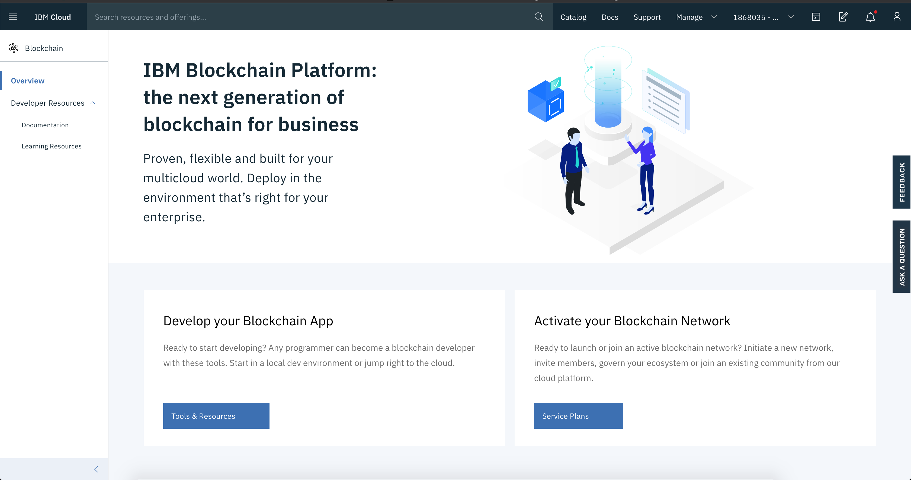
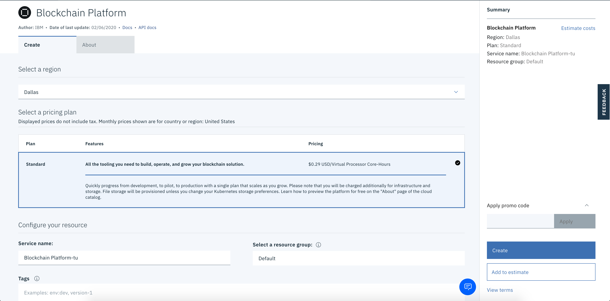
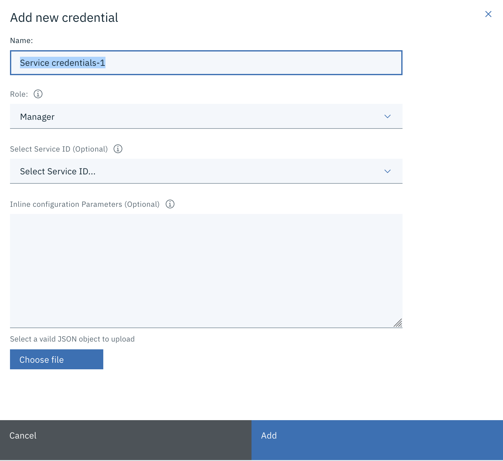
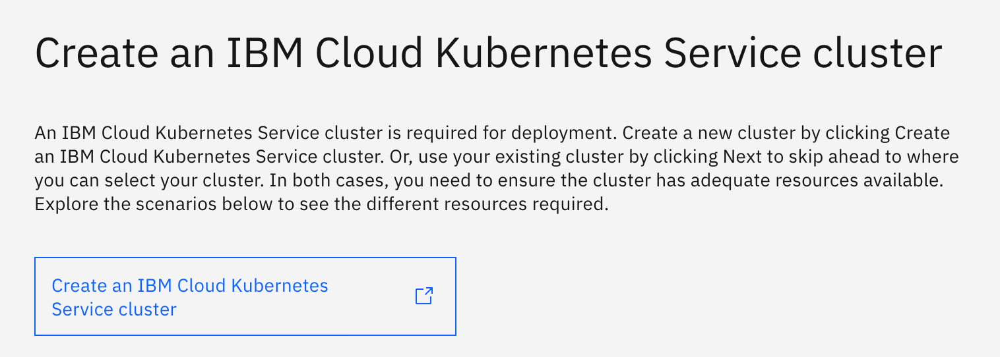
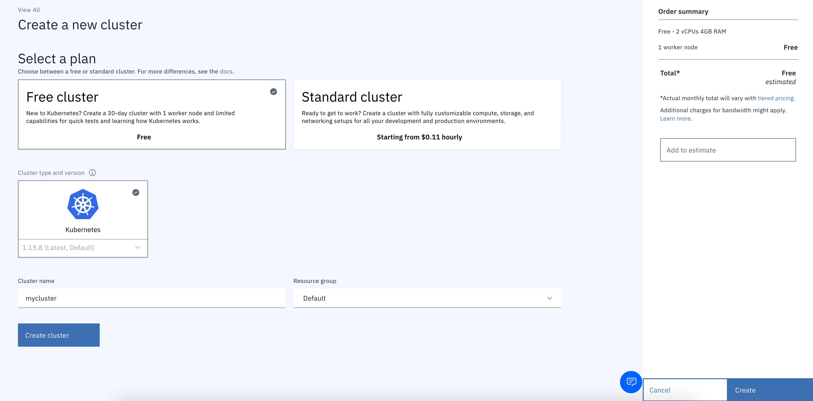
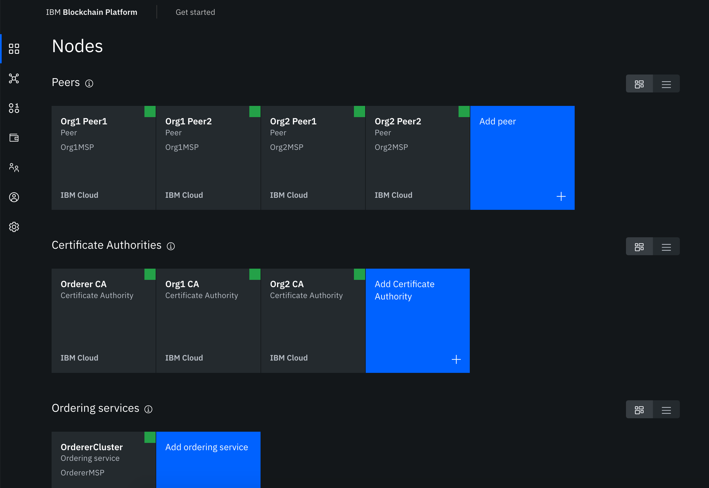

# IBPv2 Enablement Session

## Pre-requisites

To follow along with this tutorial, you will first need to follow these steps:

1. Ensure that you have all of the pre-requisites installed: https://github.com/IBM-Blockchain/ansible-role-blockchain-platform-manager#requirements

2. Install all required roles, including the `ibm.blockchain_platform_manager` role, from Ansible Galaxy:

   `ansible-galaxy install -r requirements.yml --force`

## Set up the network

In this tutorial, we're going to use an Ansible playbook to build a Hyperledger Fabric network with two organizations, `Org1` and `Org2`. Each organization has two peers. The two peers are configured with a single channel, `channel1`. The FabCar sample contract is instantiated on this channel, with an endorsement policy stating that both organizations must endorse any transactions.

### Create an instance of the IBM Blockchain Platform

First, we need to create an instance of the IBM Blockchain Platform.

1.  Head over to [IBM Cloud](cloud.ibm.com), and log in with your credentials.
2.  Click on the hamburger menu on the left, and you will see a selection of services. Click **Blockchain**.



3. Select **Service Plans**.



4. Leave all the default values. Make sure the Region is set to **Dallas**. Click **Create**.



5. Before you proceed with creating the Cluster, click on the **Service Credentials** tab on the left.

6. Click **New credential**. You should be presented with the following form:



Leave the default values as they are. Click **Add**.

7. When the credentials finish creating, click **View credentials** from the table.

You will a JSON object that looks similar to the below:

```json
{
  "api_endpoint": "https://xxxxxx-optools.uss02.blockchain.cloud.ibm.com",

  "apikey": "xxxxxx",

  "configtxlator": "https://xxxxxx-configtxlator.uss02.blockchain.cloud.ibm.com",

  "iam_apikey_description": "Auto-generated for key xxxxxx",

  "iam_apikey_name": "xxxxxx",

  "iam_role_crn": "crn:v1:bluemix:public:iam::::serviceRole:Manager",

  "iam_serviceid_crn": "crn:v1:bluemix:public:iam-identity::a/xxxxxx::serviceid:ServiceId-xxxxxx"
}
```

Save this somewhere, as we're going to need it later on in the tutorial.

8. On the tab on the left, select **Manage**. This will bring you back to the cluster installation wizard.

9. Click **Let's get setup!**

10. An IBM Cloud Kubernetes Service cluster is required for deployment, as it's the mechanism upon which the Blockchain network sits. Click **Create an IBM Cloud Kubernetes Service cluster**.



11. Continue to IBM Cloud Kubernetes service. This will open a new tab.



12. Make sure you select **Free cluster**. Click **Create**. This will start the process of spinning up your Kubernetes cluster, and might take up to a few minutes.

13. When the status of the cluster is **Normal**, go back to the wizard on the previous tab, and click **Next**.

14.

### Spin up the network

This Ansible playbook defaults to deploying to Docker. To configure the Ansible playbook to deploy to the IBM Blockchain Platform on IBM Cloud, follow these steps:

1. Edit the playbook such that the `infrastructure.type` variable is set to `saas`:

```yaml
infrastructure:

type: saas

saas: "{{ lookup('file', 'service-creds.json') | from_json }}"
```

2. Create a file named `service-creds.json` that contains valid service credentials from your IBM Blockchain Platform service instance on IBM Cloud. These service credentials should be of the format:

```json
{
  "api_endpoint": "https://xxxxxx-optools.uss02.blockchain.cloud.ibm.com",

  "apikey": "xxxxxx",

  "configtxlator": "https://xxxxxx-configtxlator.uss02.blockchain.cloud.ibm.com",

  "iam_apikey_description": "Auto-generated for key xxxxxx",

  "iam_apikey_name": "xxxxxx",

  "iam_role_crn": "crn:v1:bluemix:public:iam::::serviceRole:Manager",

  "iam_serviceid_crn": "crn:v1:bluemix:public:iam-identity::a/xxxxxx::serviceid:ServiceId-xxxxxx"
}
```

3. Run the Ansible playbook:

   `ansible-playbook playbook.yml`

4. Head over to your instance of the IBM Blockchain Platform running on IBM Cloud. You should now see your Peers, Certificate Authorities and Orderer running, like the below:



Information on the available nodes (peers, orderers, and certificate authorities) will be created under the `nodes` subdirectory. Since you are using the IBM Blockchain Platform on IBM Cloud, you **do not** need to import these JSON files. All of the nodes will already be present in your web console.

## Import the identities

The `wallets` subdirectory will contain all of the identities (certificates and private keys) enrolled by this playbook. You must be careful to persist all of these files for the next time you run this playbook, otherwise you will be unable to administer your IBM Blockchain Platform network.

Since you are using the IBM Blockchain Platform on IBM Cloud, you **do** need to import these JSON files into your wallet using the web console. You will then need to assiociate each node with the correct identity. If you do not do this, then you will be unable to administer the nodes using the web console.

Coming soon!

## Submit a transaction

Coming soon!

## Upgrade the smart contract

Coming soon!
